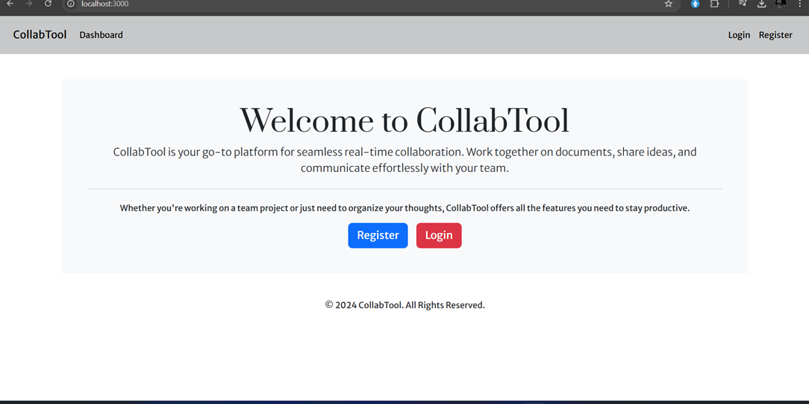
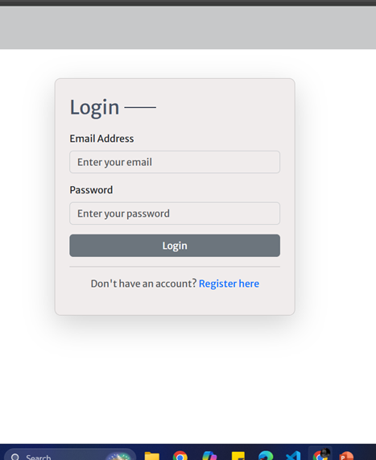
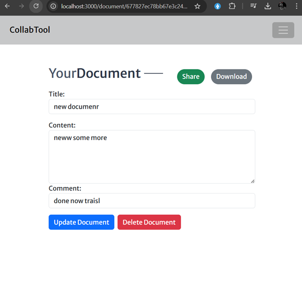
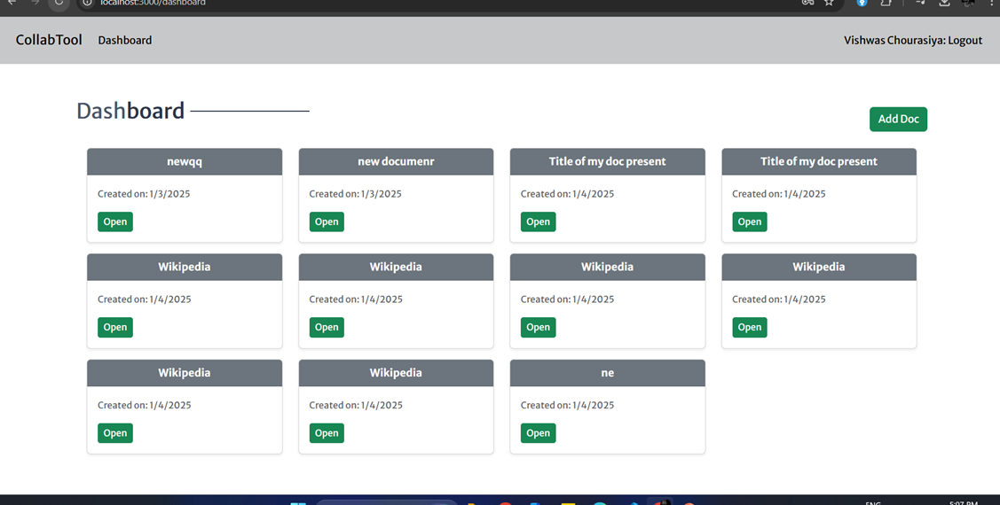

# Real-Time Collaboration Tool

A powerful real-time collaboration platform for document editing, allowing multiple users to edit, comment, and share documents seamlessly. Built with the MERN stack (MongoDB, Express.js, React, Node.js) and integrated with **Socket.IO** for real-time synchronization.

## Features

- **Real-Time Editing**: Multiple users can edit a document simultaneously with changes reflected instantly for all collaborators.
- **Commenting**: Users can add and reply to comments in real-time, making collaboration smoother.
- **Document Sharing**: Share documents with others via a secure link or email invitations, with permissions to view or edit.
- **Version Control**: Keep track of changes and revert to previous versions if needed.
- **File Download**: Download the document in various formats (PDF, DOCX, etc.) to keep a local copy.
- **Real-Time Notifications**: Receive instant updates when collaborators make changes or leave comments.

## Demo Pages

*Landing Pge*


*Login page*


*document page*


*Dashboard*



## Technologies Used

- **Frontend**: 
  - React.js for building the user interface.
  - React Router for routing and navigation.
  - Socket.IO for real-time communication.
  - React Toastify for notifications.
  
- **Backend**:
  - Node.js with Express.js for API and server-side logic.
  - Socket.IO for real-time communication between clients and server.
  - MongoDB for document storage and user management.
  
- **Authentication**:
  - JWT-based authentication for secure user access.

## Installation

### Prerequisites

Ensure you have the following installed on your local machine:

- Node.js (v14 or higher)
- MongoDB (for local development) or MongoDB Atlas for cloud-based database
- npm or yarn for managing packages

### Steps to Run the Project Locally

1. Clone the repository:
   ```bash
   git clone https://github.com/your-username/real-time-collaboration-tool.git
   ```

2. Navigate to the project directory:
   ```bash
   cd real-time-collaboration-tool
   ```

3. Install the backend dependencies:
   ```bash
   cd backend
   npm install
   ```

4. Install the frontend dependencies:
   ```bash
   cd frontend
   npm install
   ```

5. Set up your environment variables:
   - In the backend directory, create a `.env` file and add your MongoDB URI and JWT secret key:
     ```bash
     MONGO_URI=your_mongodb_connection_string
     JWT_SECRET=your_jwt_secret
     ```

6. Start the backend server:
   ```bash
   cd backend
   npm start
   ```

7. Start the frontend development server:
   ```bash
   cd frontend
   npm start
   ```

8. Open your browser and visit [http://localhost:3000](http://localhost:3000) to access the app.

## Usage

- **Login/Register**: Sign up or log in using your credentials. Upon successful authentication, you’ll be redirected to the dashboard.
- **Create/Join Documents**: Create a new document or join an existing one by sharing the document link with your collaborators.
- **Edit and Comment**: Edit the document in real-time and leave comments on specific sections to collaborate effectively.
- **Download**: Download the document in various formats or share the document link with others.

## Contributing

We welcome contributions to this project! If you'd like to improve or add features, feel free to fork the repository, create a new branch, and submit a pull request.

### Steps to Contribute:
1. Fork the repository.
2. Create a new branch for your feature or bugfix.
3. Make changes and commit them.
4. Push your changes to your fork.
5. Open a pull request to the main repository.


---
